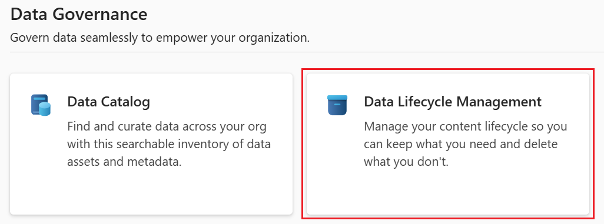
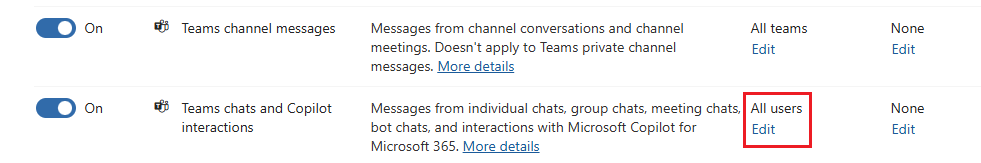
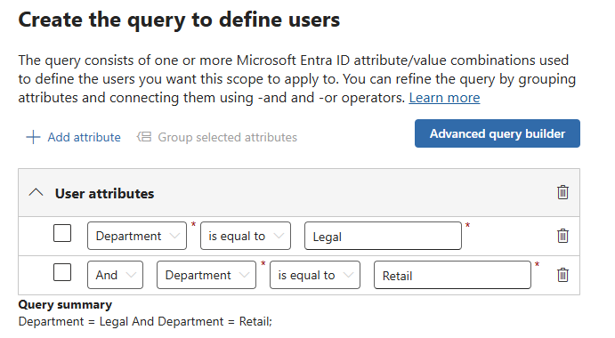

---
lab:
    task: 'Configure Retention Policies'
    exercise: 'Exercise 1 - Implement Data Lifecycle and Records Management'
---

## WWL Tenants - Terms of use

If you are being provided with a tenant as a part of an instructor-led training delivery, please note that the tenant is made available for the purpose of supporting the hands-on labs in the instructor-led training.

Tenants should not be shared or used for purposes outside of hands-on labs. The tenant used in this course is a trial tenant and cannot be used or accessed after the class is over and are not eligible for extension.

Tenants must not be converted to a paid subscription. Tenants obtained as a part of this course remain the property of Microsoft Corporation and we reserve the right to obtain access and repossess at any time.

# Skilling tasks

Your task is to create and manage retention policies that meet the required criteria:

- **Company-wide retention policy**: Apply a retention period and set the locations for this policy.
- **Location-based retention policies**: Create retention policies for specific locations, such as Teams channels and chats, including specific users.
- **PowerShell retention policies**: Implement retention policies using PowerShell.
- **Adaptive scope policies**: Create and apply retention policies with adaptive scopes for departments like legal and retail.
- **Test adaptive scope policy**: Verify the users affected by the adaptive scope and test the policy.

## Task 1 – Create company-wide retention policy

In this exercise you will create a company-wide retention policy, apply a retention period, and set the locations that the policy will be applied to.

1. In Microsoft Edge, navigate to the Microsoft Purview portal, `https://purview.microsoft.com`, and log in.
1. A message about the new Microsoft Purview portal will appear on the screen. Select the option to agree with the terms of data flow disclosure and the privacy statement, then select **Try now**.

    

1. Select **View all solutions**.
1. Under **Data Governance** select the **Data Lifecycle Management** card.

    

1. Expand **Policies** then select **Retention policies** from the left navigation pane.
1. Select **+ New retention policies**.
1. On the **Name your retention policy** page, enter the Name and Description:

   - **Name**: `Company wide`
   - **Description**: `All locations except for teams`

1. Select **Next**.
1. On the **Policy Scope page**, select **Next**.
1. On the **Choose the type of retention policy to create** page, select **Static** and then select **Next**.
1. On the **Choose where to apply this policy** page, enable:

   - Exchange mailboxes
   - SharePoint classic and communication sites
   - OneDrive accounts
   - Microsoft 365 Group mailboxes & sites

1. Select **Next**.
1. On the **Decide if you want to retain content, delete it, or both** page, for the **Retain items for a specific period** section, enter the following information:

   - **Retain items for a specific period**: Choose **Custom** from the dropdown list
   - Change the years field to **3**
   - **Start the retention period based on**: When items were last modified
   - **At the end of the retention period**: Delete items automatically

1. Select **Next**.
1. On the **Review and finish page**, select **Submit**.
1. Once your policy is created, select **Done**.

You have successfully created a retention policy for various locations. This policy retains items for three years from the last modified date.

## Task 2 – Create location-based Retention policies with filter

1. You should still be on the **Retention policies** screen in the Microsoft Purview portal. If not, in Microsoft Edge, navigate to the Microsoft Purview portal, `https://purview.microsoft.com`, and log in. Select the **Data Lifecycle Management** > **Policies** > **Retention policies**  card once logged in.
1. Select **+ New retention policy**.
1. On the **Name your retention policy** page, enter the Name and Description:

   - **Name**: `Teams Retention`
   - **Description**: `Retention for Teams locations`

1. Select **Next**.
1. On the **Policy Scope** page, select **Next**.
1. On the **Choose the type of retention policy to create** page, select **Static** and then select **Next**.
1. In the Choose locations to apply the policy section, enable:

   - Teams channel messages
   - Teams chats and Copilot interactions

   Ensure all other options are disabled.

1. For the **Teams chat and Copilot interactions** location, select the **Edit** link under **All users** and add two users.

    

1. On the **Teams chats and Copilot interactions** flyout page, once the users are added, select **Done** then select **Next**.
1. **On the Decide if you want to retain content, delete it, or both** page, enter:
   - **Retain items for a specific period**: Choose **Custom** from the dropdown list.
   - Change the years field to 3.
   - **Start the retention period based on**: When items were last modified.

1. Select **Next**.
1. On the **Review and finish page**, select **Submit**.
1. Once your policy is created, select **Done**.

You have successfully created a retention policy for Teams locations with a three-year retention period, applying a filter for specific users.

## Task 3 - Create retention policy via PowerShell

1. Open an elevated PowerShell window.
1. Enter the following cmdlet to install the latest Exchange Online PowerShell module version:

    ```powershell
    Install-Module ExchangeOnlineManagement
    ```

1. Confirm the NuGet provider security dialog with **Y** for Yes and press **Enter**. This process may take some time to complete.
1. Confirm the Untrusted repository security dialog with **Y** for Yes and press **Enter**.  This process may take some time to complete.
1. Enter the following cmdlet to change your execution policy and press **Enter**. The command assumes you're logged in as a user with appropriate permissions.

    ```powershell
    Set-ExecutionPolicy -ExecutionPolicy RemoteSigned -Scope CurrentUser
    ```

1. Confirm the Execution Policy Change with  **Y** for Yes and press **Enter**.
1. Close the PowerShell window.
1. Open a regular PowerShell window, without elevation, by selecting the Windows button with the right mouse button and select **Windows PowerShell**.
1. Connect to the Security & Compliance Center in your tenant with the following cmdlet:

    ```powershell
    Connect-IPPSSession
    ```

1. If prompted, sign in as a user with appropriate permissions.
1. Run the following cmdlet to create the first retention policy for all locations except teams:

    ```powershell
    New-RetentionCompliancePolicy -Name "Company Wide PS" -ExchangeLocation All -ModernGroupLocation All -SharePointLocation All -OneDriveLocation All
    ```

1. Run the following cmdlet to set the retention period, using days as units based on the date modified:

    ```powershell
    New-RetentionComplianceRule -Name "Company Wide PS Rule" -Policy "Company Wide PS" -RetentionDuration 1095 -ExpirationDateOption ModificationAgeInDays -RetentionComplianceAction Keep
    ```

You have successfully created retention policies through PowerShell with a three-year retention period.

## Task 4 – Create retention policy with adaptive scope

1. In Microsoft Edge, navigate to the Microsoft Purview portal, `https://purview.microsoft.com`, and log in.
1. Select **View all solutions**.
1. Under **Core** select the *Settings** card.
1. Expand **Roles and scopes** then select **Adaptive scopes**.
1. On the **Adaptive scopes** page select **+ Create scope**.
1. On the **Name your adaptive policy scope page**, enter:

   - **Name**: `Legal Documents Retention`
   - **Description**: `Retention for legal related documents`

1. Select **Next**.
1. On the **Assign admin unit page**, select **Next**.
1. On the **What type of scope do you want to create?** page, select **Users** and then **Next**.
1. On the **Create the query to define users** page, under **User attributes**, select:

   - **Attribute**: Department
   - **Operator**: is equal to
   - **Value**: `Legal`

1. Add a second attribute by select the **+ Add attribute** button with values:

   - **Query operator**: Or
   - **Attribute**: Department
   - **Operator**: is equal to
   - **Value**: Retail

    

1. Select **Next** and then **Submit** on the **Review and finish** page.
1. Once your scope has been created select **Done** to get back to the **Adaptive scopes** page.
1. Select **Home** from the left navigation pane to navigate back to the main page of the Microsoft Purview portal.
1. Select **View all solutions** then **Data Lifecycle Management** under **Data Governance**.
1. Expand **Policies** then select **Retention policies**.
1. On the **Retention policies** page select **+ New retention policy**.
1. On the **Name your retention policy page**, enter:

   - **Name**: `Legal Data Retention`
   - **Description**: `Retention of all documents within the legal and retail departments.`

1. Select **Next**.
1. On the **Policy Scope** page, select **Next**.
1. On the **Choose the type of retention policy to create** page, select **Adaptive** and then **Next**.
1. On the **Choose adaptive policy scopes and locations** page, select **+ Add scopes** and choose the **Legal Documents Retention** scope.
1. Under **Choose locations to apply the policy** ensure **Exchange mailboxes** and **OneDrive accounts** are enabled, then select **Next**.
1. On the **Decide if you want to retain content, delete it, or both** page, enter:

   - **Retain items for a specific period**: 5 years
   - **Start the retention period based on**: When items were created
   - **At the end of the retention period**: Do nothing

1. Select **Next** and then **Submit** on the **Review and finish**.
1. Once your policy is created, select **Done**.

You have successfully applied an adaptive scope to a retention policy.
