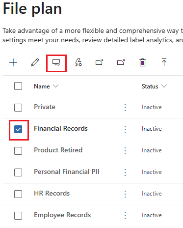
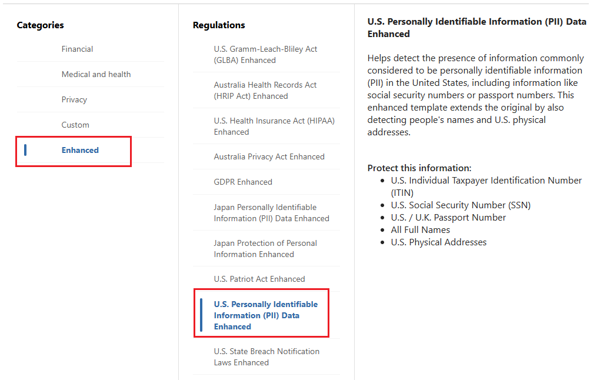

---
lab:
    task: 'Create retention labels'
    exercise: 'Exercise 2 - Create retention labels'
---

## WWL Tenants - Terms of use

If you are being provided with a tenant as a part of an instructor-led training delivery, please note that the tenant is made available for the purpose of supporting the hands-on labs in the instructor-led training.

Tenants should not be shared or used for purposes outside of hands-on labs. The tenant used in this course is a trial tenant and cannot be used or accessed after the class is over and are not eligible for extension.

Tenants must not be converted to a paid subscription. Tenants obtained as a part of this course remain the property of Microsoft Corporation and we reserve the right to obtain access and repossess at any time.

# Exercise 2 skilling tasks

Your task is to create and manage retention labels that meet the required criteria:

- **Create retention labels**: Set up retention labels for different types of documents and emails.
- **Publish retention labels**: Make the retention labels available for users to apply.
- **Auto-apply retention labels**: Configure retention labels to be applied automatically based on specific conditions.

## Task 1 – Create retention labels

In this task, you will create retention labels that can be assigned to documents and emails.

1. In Microsoft Edge, navigate to the Microsoft Purview portal, `https://purview.microsoft.com`, and log in.
1. Select **View all solutions**.
1. Under **Risk & Compliance** select the **Records Management** card.
1. In the left navigation pane, select **File plan**.
1. On the **File plan** page select **+ Create a label**.
1. On the **Name your retention label** page input:

    - **Name**: `Financial Records`
    - **Description for users**: `Assign this label to financial documents to ensure they are retained for the required period.`
    - **Description for admins**: `Financial records with retention period.`
1. Select **Next**.
1. On the **Define file plan descriptors for this label** page, select **Next**.
1. On the **Define label settings** page, choose the **Retain items forever or for a specific period** then select **Next**.

1. On the **Define the period** input:

    - **How long is the period?**: 7 Years
    - **When should the period begin?**: When items were created
1. Select **Next**.
1. On the **Choose what happens during the retention period** page select **Retain items even if users delete** then select **Next**.
1. On the **Choose what happens after the retention period** page select **Deactivate retention settings** then select **Next**.
1. On the **Review and finish page**, select **Create label**.
1. On the **Your retention label is created** page, select **Do Nothing** then select **Done**. The label will be published later in the exercise.
1. Back on the **File plan** page, select **+ Create a label** to create another retention label.
1. On the **Name your retention label** page input:

    - **Name**: `HR Records`
    - **Description for users**: `This label is auto-applied to HR records with a retention period of five years.`
    - **Description for admins**: `Auto-applied retention label for HR records.`
1. Select **Next**.
1. On the **Define file plan descriptors for this label** page, select **Next**.
1. On the **Define label settings** page, choose the **Retain items forever or for a specific period** then select **Next**.
1. On the **Define the period** input:

    - **How long is the period?**: 5 Years
    - **When should the period begin?**: When items were created
1. Select **Next**.
1. On the **Choose what happens during the retention period** select **Retain items even if users delete**, then select **Next**.
1. On the **Choose what happens after the retention period** page, select **Deactivate retention settings**, then select **Next**.
1. On the **Review and finish** page select **Create label**.
1. On the **Your retention label is created** page select **Do Nothing** then select **Done**.

You have successfully created retention labels for financial records with a seven-year retention period and HR records with a five-year retention period.

## Task 2 – Publish retention labels

Following Task 1, you will now publish the retention labels so they are available for users to apply to documents in Exchange emails and SharePoint documents.

1. You should still be on the **File plan** page in the Microsoft Purview portal. If not, in Microsoft Edge, navigate to the Microsoft Purview portal, `https://purview.microsoft.com`, and log in. Select **View all solutions**, then select **Records Management** > **File plan**.
1. Select the check mark next to the **Financial Records** retention label, then select the **Publish labels** button.

    >

1. On the **Choose labels to publish** page, the **Financial Records** retention label should be displayed.
1. Select **Next**.
1. On the **Policy Scope** page select **Next**.
1. On the **Choose the type of retention policy to create** page select **Static** then select **Next**.
1. On the **Choose where to publish labels** page select **Let me choose specific locations** and enable:

   - Exchange mailboxes
   - SharePoint classic and communication sites
   - OneDrive accounts

1. Ensure Microsoft 365 Group mailboxes & sites is set to **Off**, then select **Next**.
1. On the **Name your policy page** input:

   - Name: `Financial Records Retention Label`
   - Description: `Retention label for financial records with a seven-year retention period.`
1. Select **Next**.
1. On the **Finish** page select **Submit**.
1. On the **Your retention label was published** page select **Done**.

You have successfully published the retention label for financial records.

## Task 3 - Publish auto-apply retention labels

Following Task 1, you will now auto-apply the HR Records retention label so that information is retained.

1. You should still be in **Records Management** in the Microsoft Purview portal. If not, in Microsoft Edge, navigate to the Microsoft Purview portal, `https://purview.microsoft.com`, and log in. Select **View all solutions**, then select **Records Management**.
1. On the left navigation pane, expand **Policies**, then select **Label policies**.
1. Select **Auto-apply a label** to start the **Create auto-labeling policy** configuration.
1. On the **Let's get started** page, for **Name** and **Description** enter the following information:

   - **Name**: `HR Records auto-applied`
   - **Description**: `HR Records auto-applied retention label, with a retention period of five years for all locations.`
1. Select **Next**.
1. On the **Choose the type of content you want to apply this label to** page select **Apply label to content that contains sensitive info** then select **Next**.
1. On the **Content that contains sensitive info page**, select the **Enhanced** category and the the **U.S. Personally Identifiable Information (PII) Data Enhanced regulation**, then select **Next**.

    >

1. On the **Define content that contains sensitive info** page, leave the defaults selected, then select **Next**.
1. On the **Policy Scope** page select **Next**.
1. On the **Choose the type of retention policy to create** page, select **Static** then select **Next**.
1. On the **Choose locations to apply the policy** page, enable the options for:

   - Exchange mailboxes
   - SharePoint classic and communication sites
   - OneDrive accounts
   - Microsoft 365 Group mailboxes & sites

1. Select **Next**.
1. On the **Choose a label to auto-apply page**, select **Add label**.
1. On the **Choose a label** fly-out page on the right, select the checkbox next to **HR Records** then select **Add**.
1. Back on the **Choose a label to auto-apply** select **Next**.
1. On the **Decide whether to test or run your policy**, select **Turn on policy** then select **Next**.
1. On the **Review and finish** page, select **Submit**. When the policy is created, select **Done**.

You have successfully published a retention label with auto-apply. Over the next seven days, all relevant documents will be automatically labeled with the published label.
