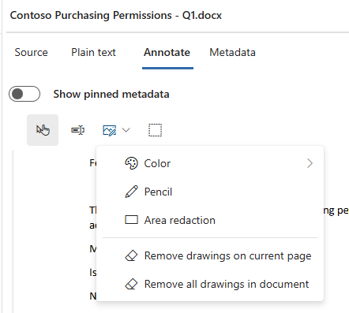

---
lab:
    task: 'Case investigation with eDiscovery'
    exercise: 'Exercise 3 - Case investigation with eDiscovery'
---

## WWL Tenants - Terms of use

If you are being provided with a tenant as a part of an instructor-led training delivery, please note that the tenant is made available for the purpose of supporting the hands-on labs in the instructor-led training.

Tenants should not be shared or used for purposes outside of hands-on labs. The tenant used in this course is a trial tenant and cannot be used or accessed after the class is over and are not eligible for extension.

Tenants must not be converted to a paid subscription. Tenants obtained as a part of this course remain the property of Microsoft Corporation and we reserve the right to obtain access and repossess at any time.

# Exercise 3 skilling tasks

Contoso suspects that sensitive payment data, including credit card and account numbers, has been mishandled or leaked. As the investigator, your job is to use Microsoft Purview eDiscovery to build a case, search across data sources, identify sensitive content, and apply redactions before producing the results for compliance or legal review.

Your task is to create and manage eDiscovery cases that meet the investigation criteria:

- **Create a new eDiscovery case**: Set up a case to manage the payment data investigation.
- **Run an eDiscovery search**: Search across data sources to identify files that may contain payment card or account information.
- **Add items to a review set**: Commit your search results to a review set for deeper analysis.
- **Tag items for review**: Apply relevance and redaction tags to organize documents for the case.
- **Apply redactions**: Use annotation tools to mask sensitive details such as card and account numbers.
- **Export results**: Export the redacted and tagged items, along with an item report, for production.

   > **Note**: This lab assumes access to an M365 E5 tenant with data to explore to conduct an investigation. You can still walk through this exercise without data, but collections and review sets will yield no results.

## Task 1 - Grant permissions for eDiscovery

To export files, you need specific permissions due to the direct access this option grants to user files.

1. In Microsoft Edge, navigate to the Microsoft Purview portal, `https://purview.microsoft.com`, and log in.

1. Select the **Settings** from the left navigation pane.

1. On the left navigation pane, expand **Roles and scopes** and select **Role groups**.

1. On the **Role groups for Microsoft Purview solutions** select **eDiscovery Manager**.

1. On the **eDiscovery Manager** fly-out page on the right, select **Edit**.

1. On the **Manage eDiscovery Manager** page, select **Choose users**.

1. On the **Choose users** fly-out page on the right, select the user you will be using to conduct the eDiscovery investigation in the next steps, then select **Select**.

    >**Note**: Ensure you select the user that will be reviewing data and exporting search results.

1. Back on the **Manage eDiscovery Manager** page, select **Next**.

1. On the **Manage eDiscovery Administrator** page, select **Next**.

1. On the **Review the role group and finish** page, select **Save** to add your user to the eDiscovery Manager role group.

1. Once you've successfully added the users, select **Done** on the **You successfully updated the role group** page.

You have successfully granted the eDiscovery Manager permission.

## Task 2 - Create an eDiscovery case

In this task, you create a new eDiscovery case to manage the payment data investigation.

1. In Microsoft Purview, select **Solutions** > **eDiscovery**.

1. On the **Cases** page, select **Create case**.

1. In the **New case** dialog window enter:

   - **Case name**: `Payment Data Leak Investigation`
   - **Case description**: `Investigation into potential exposure of payment card and account data at Contoso.`

1. Select **Create**.

   After your case is created, it will take you directly to your new case.

You have successfully created a new eDiscovery case named _Payment Data Leak Investigation_.

## Task 3 - Create an eDiscovery search

In this task, you build a search to find emails and documents that reference sensitive payment data.

1. Select **Create a search**.

1. In the **New search** dialog window, enter:

   - **Search name**: `Payment Data Exposure Search`
   - **Search description**: `Find emails and documents that reference credit cards, debit cards, or account numbers.`

1. Select **Create**.

1. On the **Payment Data Exposure Search** page, select **Add sources**.

1. On the **Search for source** page, **Filter** your sources for **Groups only**.

1. Select **Add tenant-wide sources**, and leave the checkboxes selected for **All people and groups** and **All public folders**.

1. Select **Save**.

1. Back on the **Payment Data Exposure Search** page, in the **Condition builder**, add conditions:

   - In the first box, set **Keywords Equal**, then type `credit card`.
   - In the second box, type `debit card`.
   - In the third box, type `account number`.

   > **Note**: Conditions are treated as OR, so the search returns items that include credit card, debit card, or account number.

1. Select **Run query**.

1. On the **Choose search results** page, select **Statistics**, then check **Include query keywords report**.

1. Select **Run query** to start the search.

   > **Note**: This process might take about 5 minutes to generate results.

1. When the search finishes, review your results on the **Statistics** tab. Look at item counts, data volume, and keyword hits.

1. Switch to the **Sample** tab. Select **Generate sample results**.

1. On the **Generate sample view** page, leave the defaults selected, then select **Run Query**.

   > **Note**: This process might take about 5 minutes to generate results.

1. Once the query is complete, review the results.

You successfully ran the search and reviewed results using both the Statistics and Sample views.

## Task 4 – Add your search to a review set

In this task, you commit your search results to a review set so they can be analyzed further.

1. From the **Payment Data Exposure Search** page, select **Add to review set**.

1. In the **Add to review set** flyout, select **Add to new review set**.

   - Enter a name: `Payment Data Review Set`.

1. Under **Select items to include**, keep **Indexed items that match your search query selected**.

1. Under **Select items in lists and attachments**, select **List attachments** so attached files are included in the review set.

1. Leave all other options at their defaults, then select **Add to review set**.

   > **Note**: This process might take about 5 minutes to generate results.

You successfully created the **Payment Data Review Set** and added your search results to it.

## Task 5 – Review and tag items

In this task, you filter review set items and apply tags to organize them for the investigation.

1. On the **Payment Data Review Set** page, select **Query**, then configure:

   - First dropdown: **Keywords**
   - Operator: **Equals any of**
   - Enter keywords:

     - `Visa`
     - `Master Card`
   - Select **+ Add conditions**.
   - Add condition:

     - Field: **File class**
     - Operator: **Equals any of**
     - Value: `Document`
   - Select **Run query**.

1. Select **Save** to save this search query. In the Filter name field, enter `Payment data docs`.

1. From the command bar, select **Tag files**.

1. In the **Tag files** flyout, select **Create/edit tags**.

1. On the **Manage tags** page, configure:

   - **Tag group name**: `Relevance`

     - **Tag name**: `Relevant`
     - Select **Add tag**, then add `Not relevant`
   - Select **Add tag group**.
   - **Tag group name**: `Review status`
     - **Tag name**: `Needs redaction`

1. Select **Save**, then **Close**.

1. In the **Tag files** flyout, tag the first item as **Relevant** and the second item as **Not relevant**.

1. In the review set, find **Contoso Purchasing Permissions - Q1.docx** from **Irvin S** dated **August 2, 2019**.

1. Select the item and tag it **Needs redaction**.

1. Select **Close** to close the **Tag files** flyout.

You successfully tagged relevant, not relevant, and redaction-needed documents.

## Task 6 – Apply redactions

In this task, you redact sensitive information from a document in your review set.

1. In the **Payment Data Review Set**, select the **Contoso Purchasing Permissions - Q1.docx** from **Irvin S** dated **August 2, 2019** item to open the document viewer.

1. In the viewer toolbar, select **Annotate**.

1. From the annotation tools, select the drop down for **Drawing**, then select **Area redaction**.

    >

1. With your cursor, draw a box around the sensitive information in the file, such as:

   - Visa card number
   - MasterCard number
   - Bank account number

1. Repeat as needed until all sensitive data is covered.

1. Close the document viewer.

1. Back on the **Payment Data Review Set** page, with the **Contoso Purchasing Permissions - Q1.docx** file selected, select **Actions** > **Commit Redactions To PDF**.

   > **Note**: Committing redactions saves a redacted PDF to the review set while keeping the original file unchanged.

You successfully applied redactions and committed them to a redacted PDF copy.

## Task 7 – Export results

In this task, you export the redacted and tagged items from your review set for production.

1. In the **Payment Data Review Set**, select the checkboxes next to the items you want to export.

   > Make sure to include the **Contoso Purchasing Permissions - Q1.docx** document you redacted.

1. On the command bar, select **Actions** > **Export**.

1. In the **Export** flyout, configure:

   - **Export name**: `PaymentData_Export_2025`
   - **Description**: `Export of review set items with redacted versions for Payment Data Leak Investigation.`

1. Under **Select items to include in your export**:

   - Choose **Selected documents only**.
   - Leave **Expand selected documents to include > Associated family items** checked (this ensures attachments are included).

1. Under **Export type**, select **Export items with item report**.

   - Select the **Export redaction** checkbox to include the redacted PDFs, and the **Export tags** checkbox to include tag information.

1. Under **Export format**, select **Create .msg files for messages** and leave all other defaults selected.

1. Select **Export**.

1. Select the **Process manager** to view the status of the export.

1. Select **Refresh** in the process manager until the export status is **Completed**.

1. Once the status is **Completed**, select the row for your export.

1. In the **Export** flyout, select all files under **Export packages**, then **Download**.

1. Select a location to download your exports, then navigate to the location of your downloaded exports.

1. Explore the items of your zip file.

You created a case, searched for sensitive data, added items to a review set, applied tags and redactions, and exported the redacted results. These are the key steps in conducting an investigation with Microsoft Purview eDiscovery.