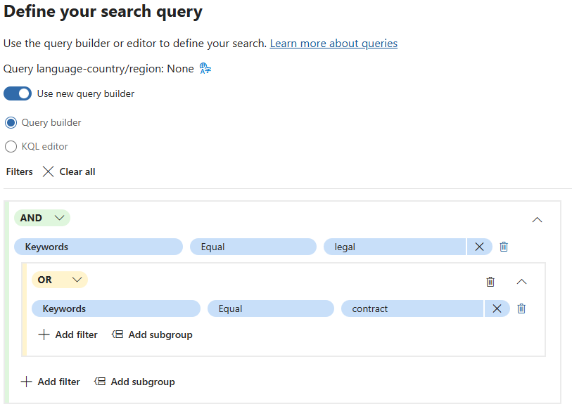
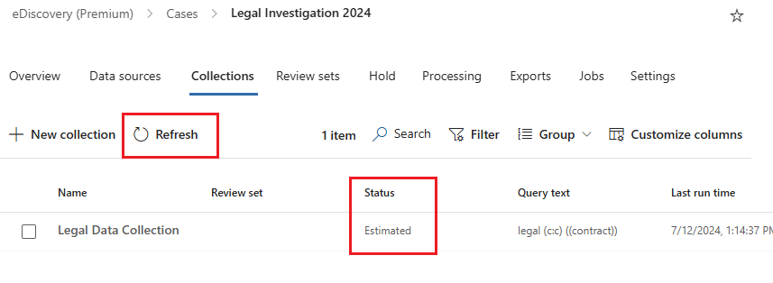
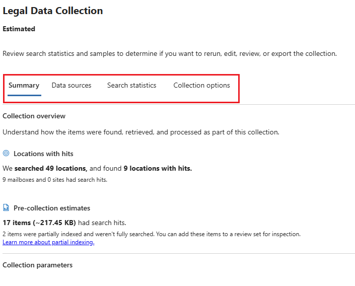
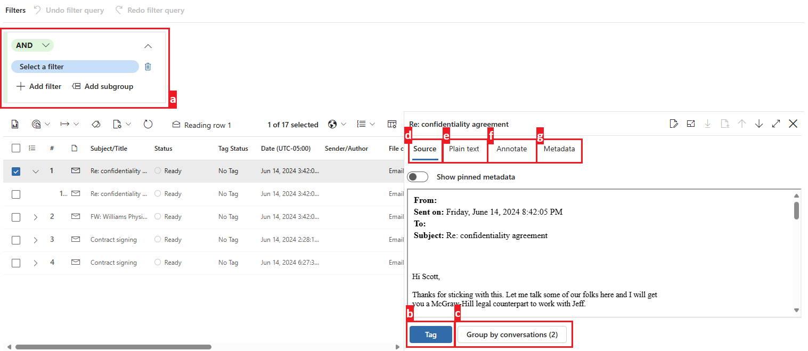
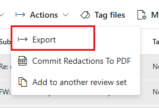
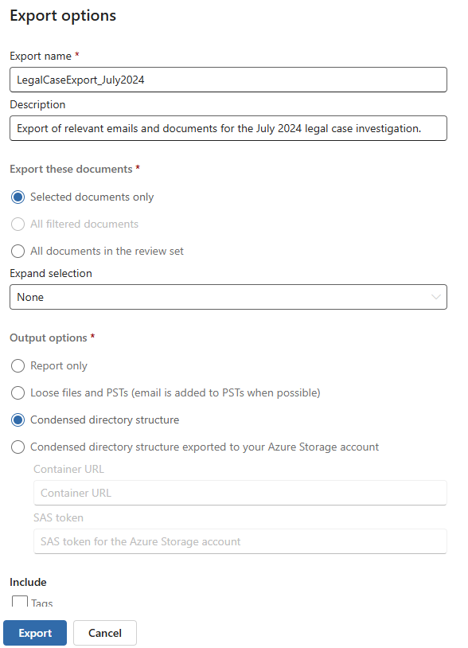

---
lab:
    task: 'Case investigation with eDiscovery (Premium)'
    exercise: 'Exercise 3 - Case investigation with eDiscovery (Premium)'
---

## WWL Tenants - Terms of use

If you are being provided with a tenant as a part of an instructor-led training delivery, please note that the tenant is made available for the purpose of supporting the hands-on labs in the instructor-led training.

Tenants should not be shared or used for purposes outside of hands-on labs. The tenant used in this course is a trial tenant and cannot be used or accessed after the class is over and are not eligible for extension.

Tenants must not be converted to a paid subscription. Tenants obtained as a part of this course remain the property of Microsoft Corporation and we reserve the right to obtain access and repossess at any time.

# Exercise 3 skilling tasks

- **Create a new eDiscovery case**: Set up a new case to begin your investigation.
- **Add custodians to the case**: Include relevant individuals who may have pertinent data.
- **Create and run a collection estimate**: Analyze data volume and relevance for the investigation.
- **Review and refine the collection estimate**: Ensure the collection meets your criteria.
- **Commit the collection to a review set**: Prepare the data for detailed analysis.
- **Export the search results**: Save the collected data for further review and compliance purposes.

>[!note] This lab assumes access to an M365 E5 tenant with data to explore to conduct an investigation. You can still walk through this lab without data, but collections and review sets will yield no results.

## Task 1 - Grant permissions for eDiscovery (Premium)

To export files, you need specific permissions due to the direct access this option grants to user files.

1. In Microsoft Edge, navigate to the Microsoft Purview portal, `https://purview.microsoft.com`, and log in.
1. Select the **Settings** card.

   If you don't see the **Settings** card, select **View all solutions** and select the **Settings** card under the **Core** section.

1. On the left navigation pane, expand **Roles and scopes** and select **Role groups**.
1. On the **Role groups for Microsoft Purview solutions** select **eDiscovery Manager**.
1. On the **eDiscovery Manager** fly-out page on the right, select **Edit**.
1. On the **Manage eDiscovery Manager** page, select **Choose users**.
1. On the **Choose users** fly-out page on the right, select the user you will be using to conduct this interactive exercise, then select **Select**.
1. Back on the **Manage eDiscovery Manager** page, select **Next**.
1. On the **Manage eDiscovery Administrator** page, select **Next**.
1. On the **Review the role group and finish** page, select **Save** to add your user to the eDiscovery Manager role group.
1. Once you've successfully added the users, select **Done** on the **You successfully updated the role group** page.
1. Select **Home** to navigate back to the home page of the Microsoft Purview Portal.

You have successfully granted the eDiscovery Manager permission.

## Task 2 - Create an eDiscovery (Premium) case

Now that you have the necessary permissions, you can create a new eDiscovery case to begin your investigation.

1. You should be on the home page of the Microsoft Purview Portal.

   If not, in Microsoft Edge, navigate to the Microsoft Purview portal, `https://purview.microsoft.com`, and log in.

1. Select **View all solutions**.
1. Under **Risk & Compliance** select the **eDiscovery** card.
1. From the left navigation pane, expand **Premium cases**, then select **Cases**.
1. On the **eDiscovery (Premium)** page, select **+ Create a case**.
1. On the **Name your case** fly-out page on the right, enter:

   - **Name**: `Legal Investigation 2024`
   - **Description**: `eDiscovery case for the 2024 legal investigation involving relevant emails and documents.`

1. On the **Add team members and configure settings** page, ensure to add the user that will be conducting the investigation, and select **Next**.
1. On the **Review your case** page, select **Submit**, then select **Done**.

You have successfully created a new eDiscovery case named _Legal Investigation 2024_.

## Task 3 – Add custodians to the case

Now that your case is created, you need to add custodians. Custodians are individuals who might possess relevant information for the investigation.

1. After creating the case in the previous task, you should be in the **Overview** tab of the **Legal Investigation 2024** case.

   If not, in Microsoft Edge, navigate to the Microsoft Purview portal, `https://purview.microsoft.com`, and log in. Select **eDiscovery** card under the **Risk & Compliance** section. Select **Premium Cases** > **Cases** and select the newly created **Legal Investigation 2024** case.

1. Select the **Data sources** tab from the top navigation, then select **Add data source** > **Add new custodians**.
1. On the **New custodian** fly-out page, under **Select custodian** add custodians to your case, then select **Next**.
1. On the **Hold settings** page, ensure the custodians you added in the previous step are selected to place on hold.
1. On the **Review your custodians** page, select **Submit**, then select **Done** once your new custodians are created.

You have successfully added custodians to the _Legal Investigation 2024_ case.

## Task 4 – Create and run a collection estimate

With custodians added, you can now run a collection estimate to get an overview of the data volume and relevance.

1. After adding custodians to the case in the previous task, you should still be in the **Data sources** tab of the **Legal Investigation 2024** case.  

   If not, in Microsoft Edge, navigate to the Microsoft Purview portal, `https://purview.microsoft.com`, and log in. Select **eDiscovery** card under the **Risk & Compliance** section. Select **Premium Cases** > **Cases** and select the newly created **Legal Investigation 2024** case.

1. Select the **Collections** tab from the top navigation, then select **+ New collection**.
1. In the **New collection** configuration, give the collection a **Name and description**. Enter:

   - **Name**: `Legal Data Collection`
   - **Description**: `Collecting emails and documents relevant to the 2024 legal investigation.`

1. Select **Next**.
1. On the **Choose custodial data sources**, select **+ Select custodians**.
1. On the **Select custodians** fly-out page on the right, add the custodians that were added to the case in the previous task, then select **Add**.
1. Back on the **Choose custodial data sources** page, select **Next**.
1. On the **Choose non-custodial data sources**, select **Next**.
1. On the **Additional locations** set the status to **On** for these locations:

   - Exchange mailboxes
   - Exchange public folders

1. Select **Next**.
1. On the **Define your search query** page, use the query builder to build a search  to find content relevant to the case:

   - Use the **AND** operator to search for **Keywords** that are **Equal** to `legal`.
   - Select **Add a subgroup**.
   - Use the **OR** operator to search for **Keywords** that are **Equal** to `contract`.

    >

1. Select **Next**.
1. On the **Review your collection and create it** page, select **Submit**, then select **Done** on the **New collection created** page.
1. Back on the **Collections** page, review the progress of your collection estimate. Use the **Refresh** button to refresh the page and check the status of the collection estimate. Once the status of your estimate updates to **Estimated**, and the **Preview status** updates to **Successful**, your collection estimate is complete.

   >[!tip] Once your collection estimate is complete, feel free to experiment building different queries or using the KQL editor for more advanced searches. To do this, select the checkbox to the left of the collection estimate and select **Edit collection**. This will take you directly to the **Define your search query** page. You can modify your query and submit a new collection estimate to explore how your query changes your collection estimate.

    >

1. Select the **Legal Data Collection** and explore the collection estimate.

   - **Summary tab**: Provides an overview of collection statistics, including items retrieved, locations with hits, and file types.
   - **Data sources tab**: Displays information about custodial and non-custodial data sources included in the collection.
   - **Search statistics tab**: Shows detailed statistics from the last collection estimate, including the number of items and data volume.
   - **Collection options tab**: Lists and explains the different options available when configuring a collection, such as including cloud attachments and conversation threads.

    >

You have successfully created and reviewed a collection named _Legal Data Collection_.

## Task 5 - Commit the collection to a review set

Once the collection is satisfactory, commit it to a review set for detailed analysis.

1. After creating the collection estimate in the previous task, you should still be in the **Collections** tab of the **Legal Investigation 2024** case.  

   If not, in Microsoft Edge, navigate to the Microsoft Purview portal, `https://purview.microsoft.com`, and log in. Select **eDiscovery** card under the **Risk & Compliance** section. Select **Premium Cases** > **Cases** > **Legal Investigation 2024** > **Collections** tab.

1. Select the **Legal Data Collection** collection.
1. On the **Legal Data Collection** fly-out page on the right, select **Commit collection**.
1. On the **Commit items to a review set** page, ensure the **Add to new review set** option is selected, and name it `Legal Case Review`.
1. Leave the other defaults selected and select **Commit** to commit the collection to a review set.

You have successfully committed the collection to a review set.

## Task 6 – Explore the review set

1. After committing the collection to a review set in the previous task, you should still be in the **Collections** tab of the **Legal Investigation 2024** case.

   If not, in Microsoft Edge, navigate to the Microsoft Purview portal, `https://purview.microsoft.com`, and log in. Select **eDiscovery** card under the **Risk & Compliance** section. Select **Premium Cases** > **Cases** > **Legal Investigation 2024**.

1. Select the **Review sets** tab from the top navigation, then select the newly created **Legal Case Review** review set.
1. On the **Legal Case Review** fly-out page on the right, select **Open review set** at the bottom of the page.
1. Explore what you can do with items in your review set:

   1. **Filters**: Allows you to apply conditions to narrow down the items displayed in the review set.
   1. **Tag**: Enables you to label documents with specific tags for better organization and identification.
   1. **Group**: Lets you organize review set content by related items such as families or conversations.
   1. **View Source**: Provides a rich view of the selected document, displaying it in its original format.
   1. **View Plain text**: Shows the extracted text of a document, ignoring embedded images and formatting.
   1. **Annotate**: Allows users to apply markups, redactions, and other annotations on the document.
   1. **View Metadata**: Displays various metadata associated with the selected document for detailed insights.

    >

1. Once you've explored your review set, you can export items for further analysis.

You have successfully opened and reviewed your review set.

## Task 7 - Export the search results

To save your work and enable further analysis, you will export the search results.

1. You should still be in the **Legal Case Review** review set in eDiscovery (Premium).

   If not, in Microsoft Edge, navigate to the Microsoft Purview portal, `https://purview.microsoft.com`, and log in. Select **eDiscovery** card under the **Risk & Compliance** section. Select **Premium Cases** > **Cases** > **Legal Investigation 2024** > **Review set** tab > **Legal Case Review**.

1. Select the checkbox next to the items you wish to export for further analysis.
1. Select the drop down for **Actions** > **Export**.

    >

1. On the **Export options** fly-out page on the right, enter:

   - **Export name**: `LegalCaseExport_July2024`
   - **Description**: `Export of relevant emails and documents for the July 2024 legal case investigation.`
   - **Export these documents**: Selected documents only
   - **Expand selection**: None
   - **Output options**: Condensed directory structure

1. Select the **Export** button at the bottom of the fly-out page.

    >

1. You should get a notification stating **A job has been created** to export your review set. Select **OK** on this notification.
1. To access your exported review set, expand **Premium Cases** from the left navigation pane, then select **Cases**. Select the **Legal Investigation 2024** case then the **Exports** tab from the top navigation.
1. Select the **LegalCaseExport_July2024** export.
1. On the **LegalCaseExport_July2024** fly-out page on the right, select the checkbox next to the left of each exported file and select **Download**. This will download a .csv summary and a zip file of exported items.

   >[!tip] You might need to disable your pop-up blocker to successfully download exported files.

You have successfully exported the search results for review.
